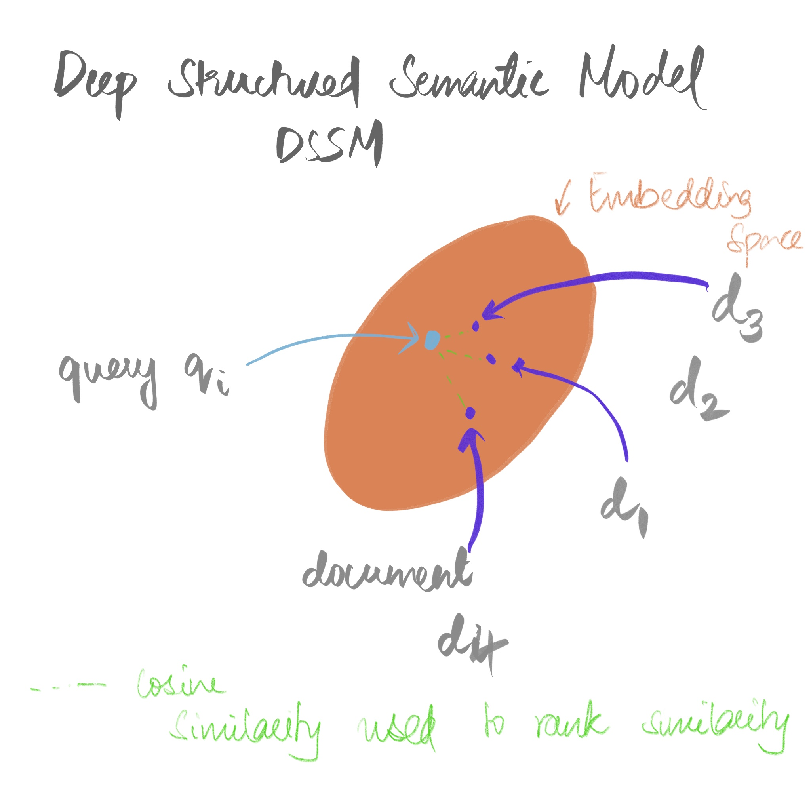
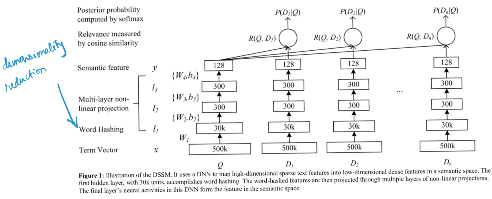

```{r setup, include=FALSE}
knitr::opts_chunk$set(echo = FALSE)
```

## Problem at hand
Throughout this post, we will be discussing this from the lens of e-commerce website, building a search engine for the user to search the product. 

In the figure, you can see it clearly, a user has a rough idea of the products they are looking for.
This problem can be modeled in the following way.

```{r fig.cap="Introduction" ,layout="1-page", code_folding=TRUE}
library(knitr)
include_graphics("images/introduction.gif")
```

<!--The crude problem can be more formally portrayed in two stages. Retrival and Ranking. 
First, we will be retrieving relevant documents, these can be products (descriptions) , or in case of web-search these are websites.
After which, these have to be ranked relevant to the each other and the query. 
-->

## Dataset
The dataset for this type of problems is typically collected by mining the logs of user-clicks.
A product that the user clicks is considered a positive and ranked higher. Other methods use a human annotator for ranking the relevance of a set of documents given a query.

## Evaluation criteria for Ranking
Before we dive into how to solve the problem, establishing the criteria to evaluate it is important. 
In this case, the relevance of ranked documents to the user is the primary criteria.
There are multiple methods of doing it, the usual precision, recall and f-score are some methods. 
For IR specifically, Discounted Cumulative Gains (DCG), it's normalized form NDCG, Mean Rank Reciprocal are used. 
We will be discussing them further here. 

### Discounted Cumulative Gains (DCG)


### Mean Rank Reciprocal (MRR)


## Learning to Rank - 101
The basis of ranking is rooted in three basic approaches of loss calculation.
Namely __Pointwise__, __Pairwise__ and __Listwise__ ranking.

Formalizing the problem, we have a set of queries $Q=\{q_1,q_2....q_n\}$, for which we need to retrieve a set of relevant documents $D=\{d_1, d_2,...d_k\}$; Each of the above approaches treats this problem differently. 

### Pointwise Ranking
In this setting, each document with respect to the query is treated independently. 
Given a query, all the documents are given a score of relevance. 

### Pairwise Ranking
Two documents are taken in conjunction and their precedence is predicted. 

### Listwise Ranking
The above two approaches do not take into account the inter-document relationship, its assumed that all the documents are independent. 

Listwise approaches are the closest to modeling the metrics that we had defined earlier.

## Traditional Ranking appraoches

Query depedent methods typically use TF-IDF __[cite this]__ or another popular LR related approach is BM25 ^[25 because it was the 25th formula that had worked for them.] __[cite this]__.

Here we discuss some of the seminal works.

### RankNet and LambdaRank
These are pairwise approaches. 
In RankNet, the query $q_i$ and document $d_k$ features are concatenated and fed through the model. 
The output for a pair of query-document $f(q_i,d_1)$ and $f(q_i,d_2)$ is compared.
The network gives a relevance score to each document and the document with the higher score is given precedence. 
Once it's done for all pair of documents, they are sorted in their order of relevance. 
The model is trained with a cross-entropy loss. 
Drawback of RankNet is that the model optimizes for only document pairs but our metric to evaluate DCG, evaluates the relative ranking of documents. 
The penalty for incorrectly ranking the first two documents will be higher than that of last two documents. 

LambdaRank is an extension of RankNet, mitigating the optimization for DCG metric by adding a $delta$ of the NDCG score if the 

### LambdaMART
Through gradient boosted trees, LambdaMart looks at the entire set of documents i.e., it's a listwise ranking.
They are branched based on their features and the results are aggregated from all the trees to give a final relevance prediction for each document. 

The progression of has been from RankNet then to LambdaRank and to LambdaMART

## Deep nerual network approaches
### Deep Structured Semantic Model (DSSM) for websearch using clickthrough data.
<!--Similar to RankNet, a fully connected network is used here as well.-->
In case of RankNet, the relevance scores of each query-document is computed and ranked accordingly.
But with DSSM, the embeddings for bag-of-words vectors of query and documents are computed independently but from the same model.
Then the cosine similarity with the query embedding and document is calculated for the semantic relevance score.
The documents are sorted based on this score.

```{r fig.cap="DSSM Overview", layout="1-page", code_folding=TRUE}
library(knitr)

```

To train the network, a posterior probability is computed for the document given a query from the semantic relevance score between them through a softmax function.
Random negative samples are included in a minibatch i.e., a completely irrelevant document and a relevant document are sampled and trained with a cross-entropy loss. 

DSSM also uses word-hashing to tackle the large dimensionaltiy introduced when working with a web-scale vocabulary by using an MLP layer as shown in figure. 

```{r fig.cap="DSSM Architecture", layout="1-page", code_folding=TRUE}
library(knitr)

```


### DRRM
TODO 

### DeText
DeText is a flexible pipeline that was built to rank LinkedIn's user profiles, jobs and help FAQs based on search queries.

## Acknowledgments {.appendix}
