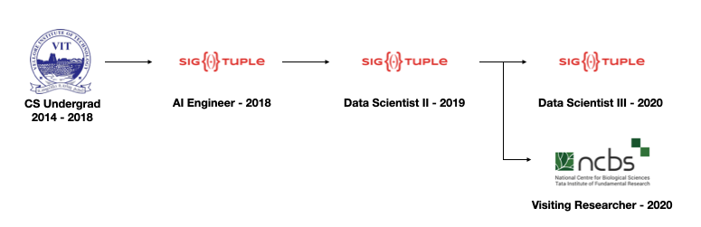

```{r fig.cap="Experience to date" ,layout="1-page", code_folding=TRUE}
library(knitr)

```

Most recently, I have joined the [ISBLab](https://www.ncbs.res.in/faculty/shruthi) at NCBS under the guidance of Dr. Shruthi Viswanath. I have been working on the generating localised precision score for integrative models.

I have worked on Computer Vision and deep learning for the last three years.
During this time I have published multiple papers as well as contributed towards patents at SigTuple.


contact: nikhil[dot]kasukurthi[at]gmail[dot]com